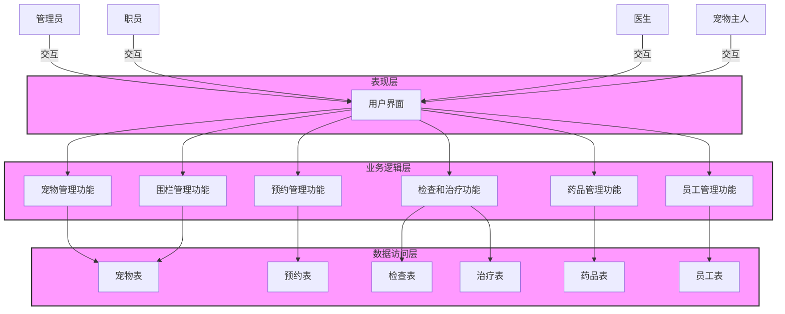

```mermaid
graph TD
    A[管理员] -->|交互| UI[用户界面]
    B[职员] -->|交互| UI
    C[医生] -->|交互| UI
    D[宠物主人] -->|交互| UI

    subgraph 表现层
        UI
    end

    subgraph 业务逻辑层
        宠物管理[宠物管理功能]
        预约管理[预约管理功能]
        检查治疗[检查和治疗功能]
        药品管理[药品管理功能]
        围栏管理[围栏管理功能]
        员工管理[员工管理功能]
    end

    subgraph 数据访问层
        宠物表[宠物表]
        预约表[预约表]
        检查表[检查表]
        治疗表[治疗表]
        药品表[药品表]
        员工表[员工表]
    end

    UI --> 宠物管理
    UI --> 预约管理
    UI --> 检查治疗
    UI --> 药品管理
    UI --> 围栏管理
    UI --> 员工管理

    宠物管理 --> 宠物表
    预约管理 --> 预约表
    检查治疗 --> 检查表 & 治疗表
    药品管理 --> 药品表
    围栏管理 --> 宠物表
    员工管理 --> 员工表

    classDef layer fill:#f9f,stroke:#333,stroke-width:2px;
    class 表现层,业务逻辑层,数据访问层 layer;

  
```